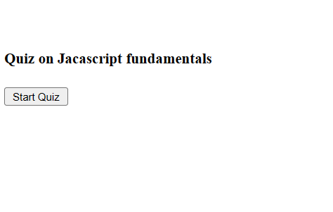
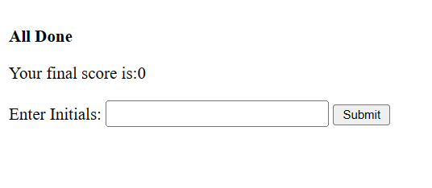
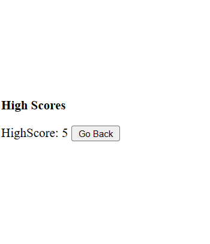

# Motivation

To develop timed Quiz on Javascript fundamentals that stores high score of the user.

# Table of Contents

1. [About the Project](#about-the-project)
2. [Screenshots](#screenshots)
3. [URL](#url)
4. [Author](#author)

## About the Project

- This application is developed using Web API's, Javascript, Html and Css.
- User is presented with first question and answer options, on choosing the option the next question and answer options gets displayed and so on until the last question reaches / timer reaches zero indicating the game over.
- Application displays the user score followed by highest score of the user scored so far.

## Screenshots

## URL

# Author

Sangeetha Gnanavel, a Full Stack Developer having enormous experience in Front-end and Back-end application development.

**[Back to top](#table-of-contents)**
